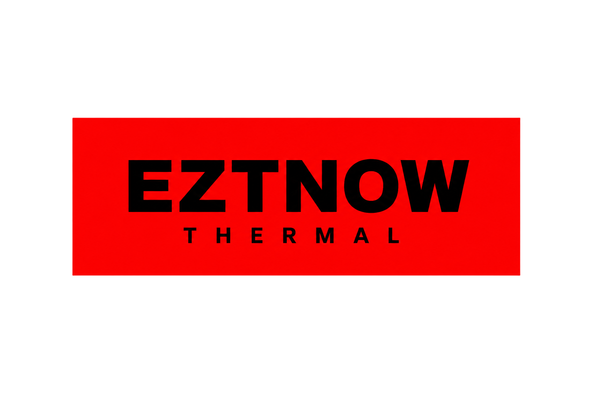
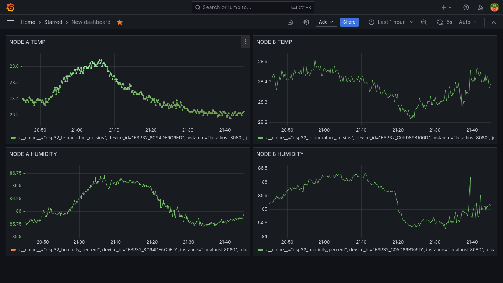
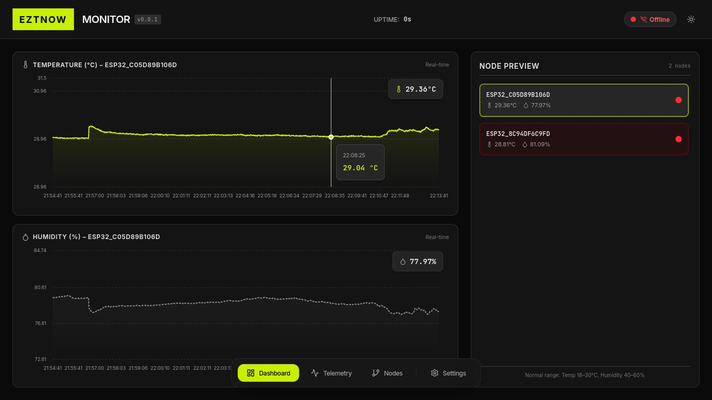

<div align="center">
  
</div>

<br>

An ESP32 + SHT40 temperature/humidity monitoring system powered by
[MAWMAW](https://github.com/kyuQee/mawmaw).

The ESP32 collects environmental data (temperature and humidity) and streams it to a local telemetry
server running MAWMAW. Prometheus and Grafana are used for metrics storage
and visualization. (previously [eztnow-gui](https://github.com/kyuQee/eztnow-gui) was used)

The system is designed to be simple:
- cheap ESP32 sensor nodes
- local WiFi telemetry (no router needed except main laptop/server)
- real-time dashboards
- extensible Python processing layer

---

# System Overview

```

[SHT40 Sensor]
|
| I2C
|
[ESP32 Node]
|
| WiFi
|
[MAWMAW Telemetry Engine]
|
+------------+
|            |
Prometheus     Python Scripts
|
Grafana Dashboard

```

---

# Hardware

## ESP32

This project was developed using:

- NodeMCU ESP32 WiFi/Bluetooth Development Board
  https://robocraze.com/products/nodemcu-32-wifi-bluetooth-esp32-development-board30-pin

However, **almost any ESP32 development board will work.**

The firmware uses the generic:

```

esp32doit-devkit-v1

```

PlatformIO configuration, so you are free to use whichever ESP32 board is
cheapest or easiest to obtain.

Typical prices:

```

₹300-400 INR

```

for normal non-bulk ESP32 dev boards.

Examples:

- ESP32 DevKit V1
- NodeMCU ESP32
- ESP32-WROOM boards
- ESP32-C3 boards (with minor pin changes)

---

## Temperature Sensor

This project uses the:

**SHT40 Temperature + Humidity sensor**

chosen because:

- Higher accuracy than common alternatives
- Built-in heater functionality
- Temperature + humidity measurement
- Very low cost

Comparison:

| Sensor | Temperature Accuracy |
|-|-|
| SHT40 | ±0.2°C |
| DHT22 | approximately ±0.5°C |

For this application the SHT40 provides significantly better measurements
while remaining inexpensive.

---

## Recommended SHT40 Board

Use:

7semi SHT40 I2C Nano Breakout

link: https://robocraze.com/products/7semi-sht40-i2c-temperature-humidity-sensor-nano-breakout

This version already includes the correct connector spacing for normal
Dupont jumper wires.

---

## Warning: Original SHT40 Breakout

I originally used:

7semi SHT40 Breakout Board

link: https://robocraze.com/products/7semi-sht40-temperature-humidity-sensor-breakout-board

However:

```

Sensor connector pitch:
1.27mm

Normal Dupont jumper pitch:
2.54mm

```

The connector spacing is exactly half.

Therefore:

- difficult to prototype
- requires manual soldering
- not recommended unless you are comfortable soldering small connections

The Nano Breakout version avoids this problem for almost the same price.

---

# Wiring

SHT40 → ESP32

| SHT40 | ESP32 |
|-|-|
| VCC | 3.3V |
| GND | GND |
| SDA | GPIO 21 |
| SCL | GPIO 22 |

---

# ESP32 Firmware Setup

## Requirements

Install:

- VSCode
- PlatformIO extension

Installation guide:

platformIO: https://platformio.org/install


PlatformIO handles:

- ESP-IDF setup
- dependencies
- flashing
- serial monitoring

---

# Create PlatformIO Project

Create a new project in VSCode.

Use:

```

Framework:
ESP-IDF

Board:
ESP32 DOIT DevKit V1

````

Replace your `platformio.ini` with:

```ini
[env:esp32doit-devkit-v1]
platform = espressif32
board = esp32doit-devkit-v1
framework = espidf

monitor_speed = 115200
monitor_filters = esp32_exception_decoder, colorize

board_build.extra_components = components
````

---

# Install SHT40 ESP-IDF Component

Inside:

```
components/
```

clone:

```
git clone https://github.com/esp-idf-lib/sht4x
```

This provides the ESP-IDF driver for the SHT40 sensor.

---

# Add Firmware

Copy:

```
esp32/main.c
```

from this repository into:

```
src/main.c
```

(or your PlatformIO configured source directory)

---

# Build and Upload

Using VSCode PlatformIO:

```
Build
Upload
Monitor
```

The serial monitor should show sensor readings.

---

# Backend Setup

The backend uses:

## MAWMAW

Repository:

[https://github.com/kyuQee/mawmaw](https://github.com/kyuQee/mawmaw)

Clone and build MAWMAW following its documentation.

Important:

Currently, build MAWMAW locally instead of using releases. (Set -DPAYLOAD_MAX=8120 or lower in case of stack overflow on your system)

Reason:

The current release has an issue where the Python interpreter path is
resolved during compilation instead of runtime.

This will be fixed in future versions.

---

# Prepare EZTNOW Thermal

Clone this repository:

```
git clone https://github.com/kyuQee/EZTNOW-thermal
```

Copy the MAWMAW binary you built:

```
mawmaw/build/server/mawmaw
```

into:

```
EZTNOW-thermal/
```

---

# Installing Grafana + Prometheus

A setup script is provided:

```
bash setup-rocky.sh
```

Currently targeted towards Rocky Linux.

Other x86-64 Linux distributions should work with minor modifications.

The script installs:

* Prometheus
* Grafana
* required dependencies

---

# Running the System

Start everything:

```
python3 run.py
```

This launches:

* MAWMAW server
* Prometheus exporter
* Grafana integration

The script may request:

```
sudo
```

permissions.

This is required because it creates a WiFi access point.

---

# ESP32 Connection

Power the ESP32 from any USB source:

Examples:

* Laptop USB
* PC USB
* Phone charger
* Power bank
* TV USB port

The ESP32 connects automatically to the configured access point.

Typical range:

```
~30 metres outdoors
```

Indoor range will depend on walls and interference.

---

# Network Security

Current version:

* open development WiFi
* no authentication

This is intentional for development simplicity.

For production deployments:

implement:

* WPA authentication
* device identities
* encrypted communication

Also to be an AP the ingestor plugin disables `firewalld` (hence the sudo) to setup hotspot to recieve data.

---

# Grafana

After startup:

Open Grafana and visualize:

* temperature
* humidity
* device status
* telemetry history

---

# Extending The System

The Python processing layer is fully configurable.

Main file:

```
scripts/prometheus_exporter.py
```

You can add:

* new metrics
* processing pipelines
* alert conditions
* custom routes
* additional telemetry handlers

Because processing happens in Python, future possibilities include:

* machine learning inference
* anomaly detection
* predictive monitoring

---

# Performance

MAWMAW provides extremely low overhead telemetry processing.

Typical processing latency:

```
< 1ms
```

(depending on hardware)

For detailed architecture and benchmarks see:

MAWMAW documentation.

---

# Current Limitations / TODO

* ESP-MESH support
* authentication
* Slack notifications
* Email alerts
* production deployment hardening

---

# Final Result

A complete low-cost environmental monitoring system:

ESP32 + SHT40
+
MAWMAW telemetry engine
+
Prometheus
+
Grafana

**COST: less than 700 INR per node**

## Screenshots

<div align="center">
  
</div>

<hr/><br/>
<div align="center">
  
</div>


